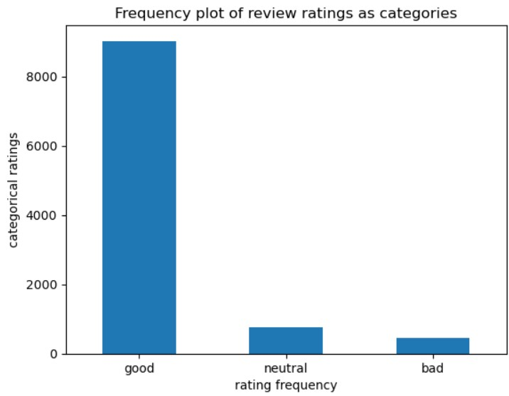
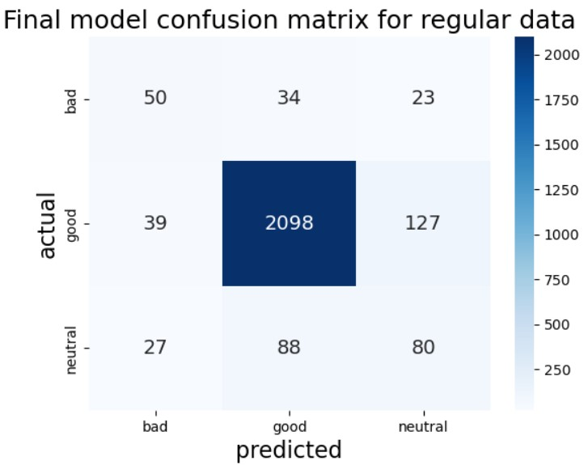
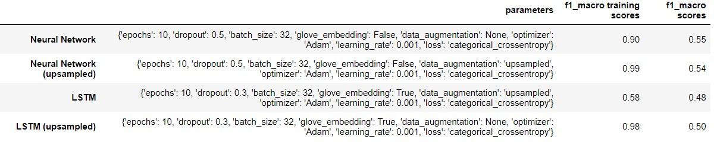

# Amazon Musical Instrument Sentiment Analysis

Online shopping has revolutionized the way people buy and sell products, and this of course includes instruments. With countless types of instruments and related accessories available on the websites like Amazon, customers rely heavily on product reviews to inform their purchasing decisions. As a result, sentiment analysis has become an increasingly popular tool for businesses to understand customer feedback and improve product offerings. Here we will explore the results of this sentiment analysis project, where we will go over all steps of the data science lifecycle. Of course, the purpose of sentiment analysis is to find valuable insights and the strengths and weaknesses of products, as well as identify areas for improvement, but this is typical and not hard to interpret. Thus, we will focus more on the technical aspects of this project, and show what the best model is in detail, and how it was obtained.

## Data Wrangling and EDA

[Data Wrangling and EDA Notebook](https://github.com/RavinderRai/Amazon_Instrument_Sentiment_Analysis/blob/main/notebooks/Data_Wrangling_and_EDA.ipynb)

The data here comes from kaggle (https://www.kaggle.com/datasets/eswarchandt/amazon-music-reviews/discussion/161304), so data collection was easy. Luckily the only cleaning we really had to do was the typical text cleaning you would do in any NLP project. Aside from that, there were a few other columns in this dataset not usually present in these types of projects, like the helpfullness column. This column gave us some idea on if a review was actually good or not. It seems like in the future perhaps this feature might be useful in building another sentiment analysis model.

Other than that, the most notable thing here was the distribution of the sentiments. There are only three here, namely good, bad, and neutral. As you can see below, the data is quite imbalanced. This was a great challenge here, and the modelling aspect of the project tries to tackle getting a good model to work with this data.

## Pre-Processing and Modeling

[Pre-Processing and Modeling Notebook](https://github.com/RavinderRai/Amazon_Instrument_Sentiment_Analysis/blob/main/notebooks/Pre-Processing_and_Modelling.ipynb)

Now to get the pre-processing and modelling part. This notebook is quite long, but can be summed up quickly. Essentially, two models were attempted first, the Naive Bayes and SVM models. Both of these model showed serious overfitting in that they could not predict either of the minority classes at all. Thus we quickly moved on to neural networks. We tried two neural networks, one with and LSTM and one without. We tried various sampling techniques including upsampling, downsampling, and SMOTE. We also tried using class weights, and a pre-trained word embedding layer using glove. In the end, the best model obtaine was with the original untampered data, but the upsampling data came close as well. See below for the best models confusion matrix.

Interestingly, the glove embedding layer when used with the LSTM on the original data did not overfit as much as the other models. So perhaps with more model tuning we could find a better model here. See below again for all model metrics.

## Future Improvements and Revisions

To continue improving, there are a few notable things left to still try. Firstly, we should try these oversampling techniques with the Naive Bayes and SVM models, which was something time did not permit. We could also augment the data with newly created data by replacing words with similar words. Moreover, there are other types of upsampling techniques similar to SMOTE to try, as can be seen in the SMOTE documentation for starters. Finally, a mix of upsampling and downsampling techniques might help prevent overfitting as well. Furthermore, there is some future work to continue this project that could be done, as alluded to earlier. This was building a second model to predict the sentiment of the reviews, that way we don't have to worry about the quality of the reviews.
